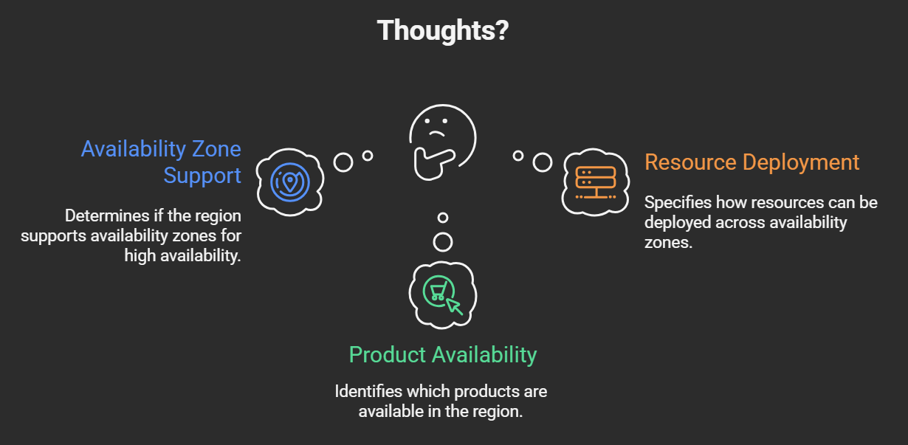
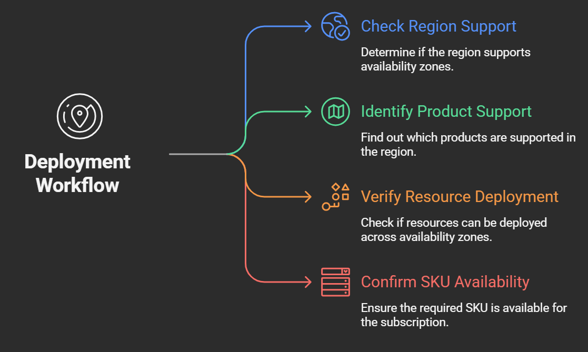

# Thoughts When Dealing with Regions, Availability Zones, and Supported Services or Resources


> 💡 **Note**
This document presents a structured approach for evaluating Azure region capabilities, availability zone support, and resource deployment strategies. The intent is to leverage real-world events—such as use case, issues, queries, troubleshooting scenarios, limitations etc—to accelerate learning and deepen understanding of various Azure constructs.


### Scenario:  I am getting error - “AvailabilityZoneNotSupported” or "SkuNotAvailable" or "InvalidTemplateDeployment" when provisioning Azure resource. How to troubleshoot this error?

Possible Cause : Restrictions may be due to subscription limits, regional capacity, or SKU availability.





## 1. Check Region Support for Availability Zones

* Use the official Azure documentation to verify if a region supports availability zones.
* Reference: <https://learn.microsoft.com/en-us/azure/reliability/regions-list>

## 2. Identify Product Support by Region

* Use the product availability table to determine which services are supported in a specific region.
* Reference: \[Products by Region Table\] (<https://azure.microsoftnfrastructure/products-by-region/table>)

## 3. Determine Resource Deployment Across Zones

Ask Yourself:

* Can this service be deployed in multiple availability zones?
* Is it available in all zones?
* Does it only support regional deployment?

Possible answers:

* Service can be deployed in 1 or 2 availability zones.
* Service can be deployed in all zones.
* Service only supports regional deployment (for now).

> **Note:** Availability zone support is gradually rolled out for services.

## 4. Confirm SKU Availability Using Azure CLI

Sometimes SKU's are not available in all zones simultaneously. Use these commands to check SKU availability and restrictions:

**List SKUs with restrictions:**

`az vm list-skus --location centralus --resource-type virtualMachines --output table --query "\[?family=='standardDPSv5Family'\].\[name,family,tier,size,restrictions\]"`

 or 
 
`az vm list-skus --location centralus --output json --query "[?name=='Standard_D8ps_v5'].restrictions"`

```
{
  "reasonCode": "NotAvailableForSubscription",
  "restrictionInfo": {
    "locations": ["centralus"],
    "zones": ["2"]
  },
  "type": "Zone",
  "values": ["centralus"]
}
```

Read the above info like this -

`NotAvailableForSubscription` → Your subscription is not allowed to use this SKU in the specified zone

`["centralus"]` → The restriction applies to the Central US region.

`["2"]` → Specifically applies to **Zone 2** in Central US.

`Zone` → This restriction is **zone-specific**, not region-wide

`["centralus"]` → Reiterates the affected region.

## Another method -

You can view all the compute resources for a location's availability zones. By default, only SKUs without restrictions are displayed. To include SKUs with restrictions, use the --all parameter.

`az vm list-skus --location centralus --resource-type virtualMachine  --Name Standard_D8ps_v5 --zone --all --output table`

## 5. **If SKU Not Available**

* Submit a request to Azure Support.
* Reference:  


